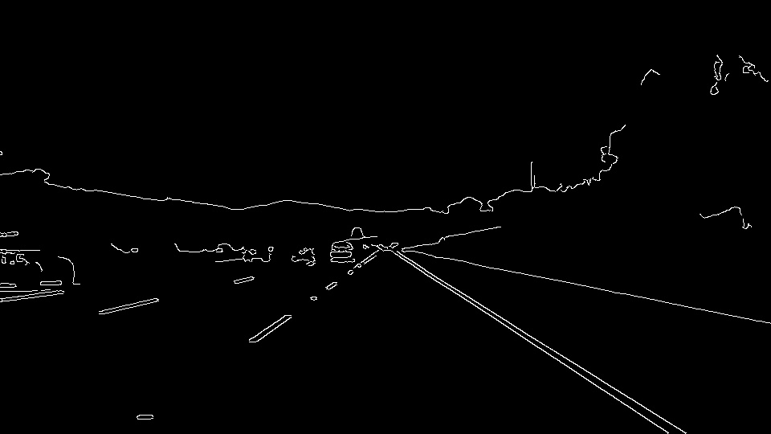

# **Finding Lane Lines on the Road** 

Overview
---

When we drive, we use our eyes to decide where to go. The lines on the road that show us where the lanes are act as our constant reference for where to steer the vehicle.  Naturally, one of the first things we would like to do in developing a self-driving car is to automatically detect lane lines using an algorithm.

In this project you will detect lane lines in images using Python and OpenCV.  OpenCV means "Open-Source Computer Vision", which is a package that has many useful tools for analyzing images.  

### 1. Pipeline

To find lanes from a front facing camera, image processing must be used in a pipeline. My pipeline process starts with converting multichannel image to grayscale. To remove the noise from gray image, Gaussian Filter is applied on grayscale image with kernel size 7. Then canny edge detector used on a filtered image with recommended 1:3 threshold ratio, which is 50-150. After that, the best region of interest(ROI) area was chosen, which vertex coordinates are (200,540),(420,320),(480,320),(920,540). Passing with original image and vertex coordinates into region_of_interest function, it returned masked edges. Masked edges was used to find edges in ROI and draw lines on the image. To find image, params were used as following: rho=1, theta=np.pi/180, threshold=15, min_line_length=60, max_line_gap=30. Edges were highlighted on the original image as a final step.

In order to draw a single line on the left and right lanes, the draw_lines() function was modified by finding the slope first. Left and right lanes have different slopes. If the slope is negative, it indicates that we are handling with right lane, positive slope shows the left lane. Each line have slightly different slope-x1-x2-y1-y2 values, that's why the average of them was taken to find final top and bottom x-y coordinates of a line. If no line has found, default top and bottom coordinates specified.

Below images shows the several steps of transformation from the raw original image to final image.

 <em>Fig. 1: Original(raw) Image</em>  

 <em>Fig. 2: Grayscale Image </em>  

 <em>Fig. 3: Canny Edges</em>  

 <em>Fig. 4: Masked Image</em>  

 <em>Fig. 5: Final Image</em>  

### 2. Shortcomings

One potential shortcoming would be what would happen when camera is located at different position or orientation. Most of the pixel coordinates are hardcoded, when camera is located with different position or orientation, all coordinates would be calculated again and again. This effects the calibration process in a negative manner.

Codes look messy within the jupyter notebook. It looks harder to follow the pipeline and it has a downside of reusability.

### 3. Improvements

A possible improvement would be changing the programming language. In a mobile systems, C++ would be a better choice due to the closeness to hardware level and less memory needs.

A class structure can be added to pack things up.