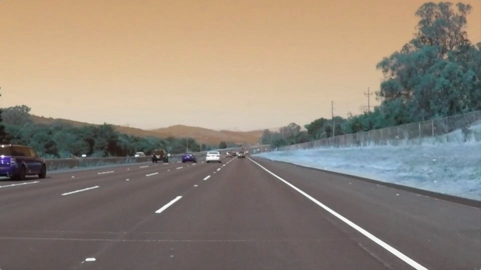
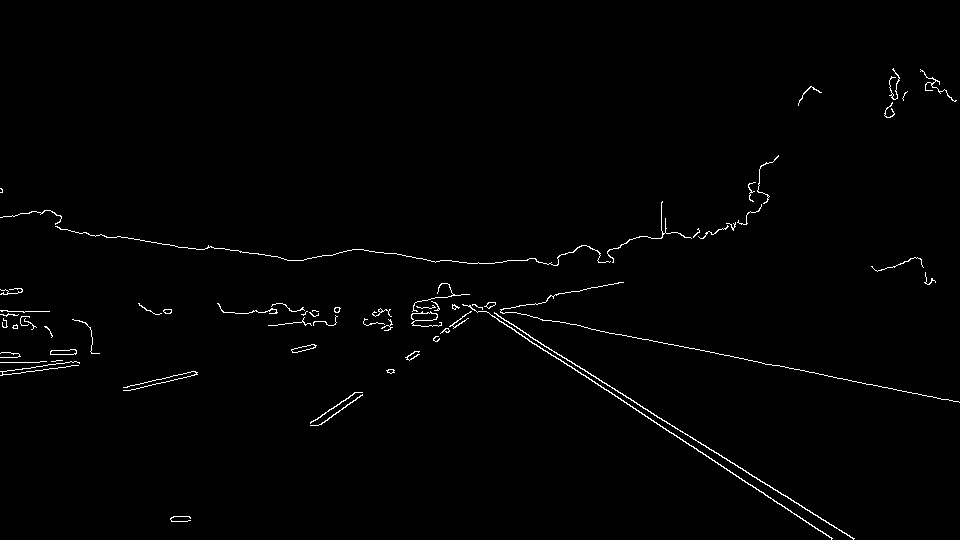
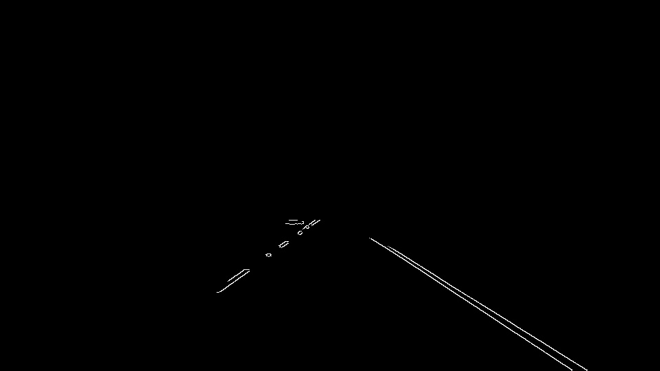
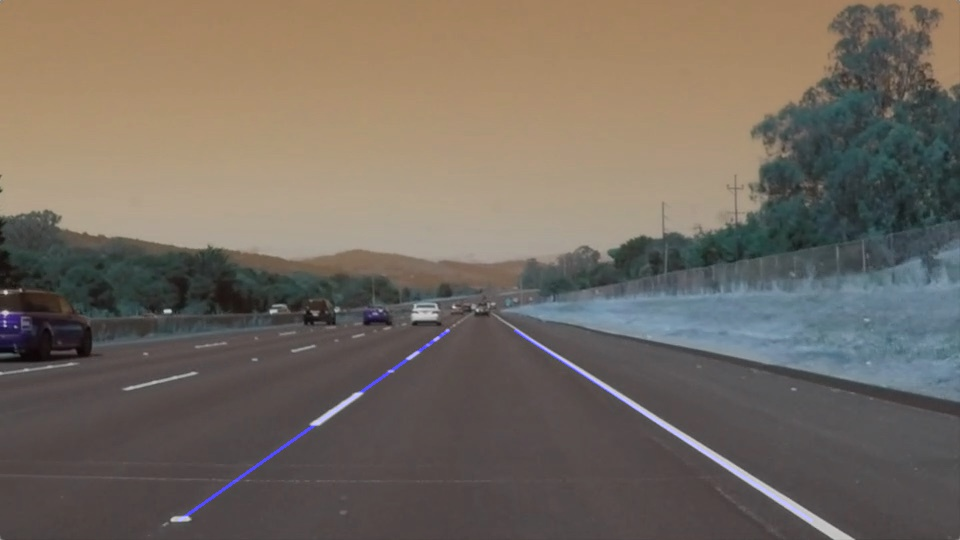

## Finding Lane Lines on the Road

### 1. Pipeline

To find lanes from a front facing camera, image processing must be used in a pipeline. My pipeline starts with converting multichannel image to grayscale. To remove the noise from gray image, I applied Gaussian filter with kernel size 7. Then I applied canny edge detector on a filtered image with recommended 1:3 threshold ratio, which I chose 50-150. After that, I tried to choose the best region of interest area, which vertex coordinates are (200,540),(420,320),(480,320),(920,540). Passing with original image and vertex coordinates into region_of_interest function, it returned masked edges. I used masked edges to find and draw lines on the image. To find image, I used params as following: rho=1, theta=np.pi/180, threshold=15, min_line_length=60, max_line_gap=30. I highlighted the edges on the original image as a final step.

In order to draw a single line on the left and right lanes, I modified the draw_lines() function by finding the slope first. Left and right lanes have different slopes. If the slope is negative, it indicates that we are handling with right lane, positive slope shows the left lane. Each line have slightly different slope-x1-x2-y1-y2 values, that's why I take an average of them to find final top and bottom x-y coordinates of a line. If no line has found, default top and bottom coordinates specified.

Below images shows the several steps of transformation from the raw original image to final image.

### 2. Shortcomings

One potential shortcoming would be what would happen when camera is located at different position or orientation. Most of the pixel coordinates are hardcoded, when camera is located with different position or orientation, all coordinates would be calculated again and again. This effects the calibration process in a negative manner.

Codes look messy within the jupyter notebook. It looks harder to follow the pipeline and it has a downside of reusability.

### 3. Improvements

A possible improvement would be changing the programming language. In a mobile systems, C++ would be a better choice due to the closeness to hardware level and less memory needs.

A class structure can be added to pack things up.